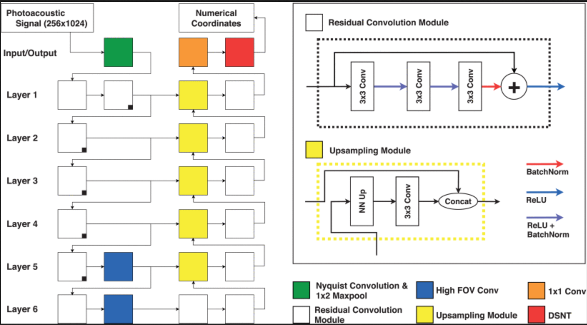

# Photoacoustic Wavefront Localization

A simplified, flexible and clear to understand PyTorch implementation of the paper 'A Deep Learning Approach to Photoacoustic Wavefront Localization in Deep-Tissue Medium'.

## Architecture
<p align = "center">
  
</p>

## Setup
```
$ git clone --recursive https://github.com/pramethg/localization.git
$ cd localization/
$ python -m venv torchenv
$ source torchenv/bin/activate
$ pip install -r requirements.txt
```

## Reference
```
@ARTICLE{localization,
  title = {A Deep Learning Approach to Photoacoustic Wavefront Localization in Deep-Tissue Medium}, 
  author = {Johnstonbaugh, Kerrick and Agrawal, Sumit and Durairaj, Deepit Abhishek and Fadden, Christopher and Dangi, Ajay and Karri, Sri Phani Krishna and Kothapalli, Sri-Rajasekhar},
  journal = {IEEE Transactions on Ultrasonics, Ferroelectrics, and Frequency Control},
  doi = {10.1109/TUFFC.2020.2964698}
  }
```